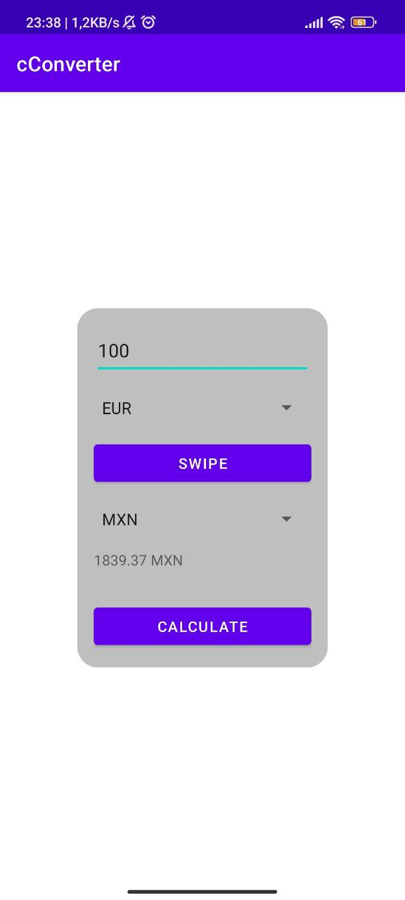

# cConverter

Welcome to cConverter! This is a simple app made with [Android](https://www.android.com/)
to get currency conversion.

## Table of Contents

- [Getting Started](#getting-started)
- [Usage](#Usage)
- [License](#license)

## Getting Started

To use cConverter on your local machine, follow these steps:

1. Clone this repository: `git clone https://github.com/enriqueseor/cconverter.git`
2. Open the project in Android Studio.
3. Select a virtual or physical device.
4. Build and Run the project.

## Usage

- Input the amount, the base currency and the quote currency
- Press the calculate button and get the conversion value.

## License

This project is licensed under the [MIT License](LICENSE).
